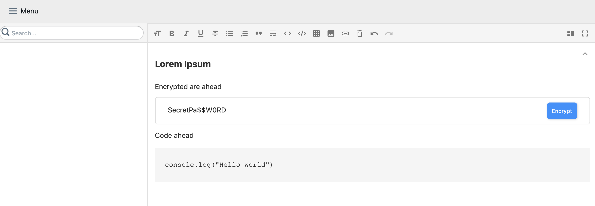

## MarkIt

Another markdown editor which helps you encrypt/decrypt any text and sync data safely in cloud like Google drive

### Screen


#### Custom markdown tag for encrypting data

```
@[encr](YourSuperSecretText|false)
```

```false``` means its not encrypted yet. A button will appear in rendered area which will help encrypt or decrypt